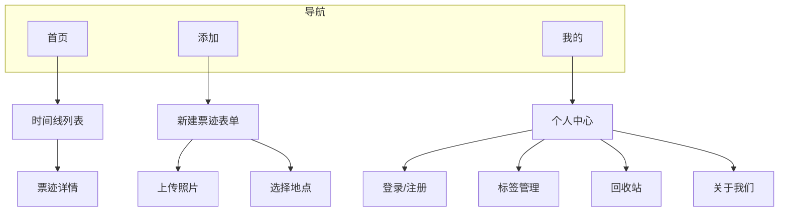
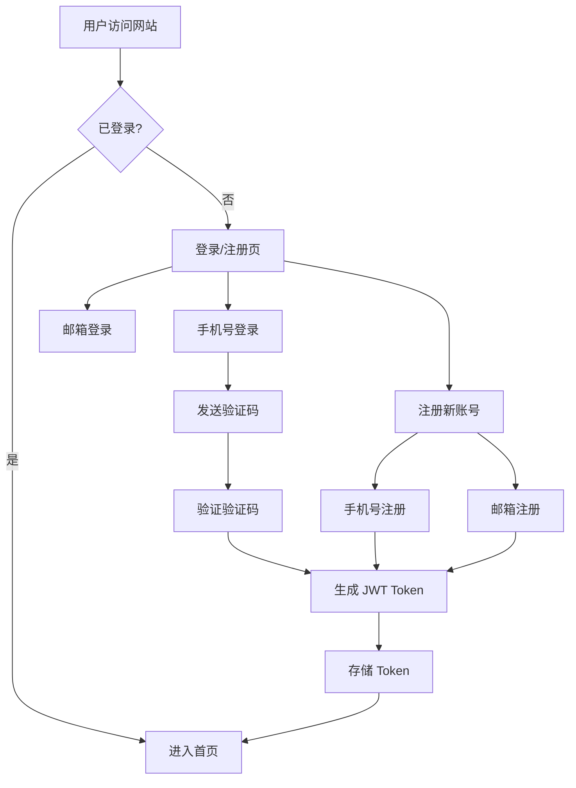

# 票迹 Web 版 - 产品需求文档 (PRD)

> **版本变更**: 从微信小程序 → 独立 Web 网站
> 
> **继承内容**: MVP 核心功能保持不变，调整技术实现方案

## 一、产品概述

### 1.1 产品名称
**票迹** (Web 版)

### 1.2 产品定位
一款帮助用户收藏票据、记录人生轨迹的回忆类 **Web 应用**。

### 1.3 目标用户
- 喜欢记录生活的年轻人
- 经常参加活动、看演出、旅行的用户
- 希望留存美好回忆的用户
- **新增**：PC 端用户（方便在电脑上整理和浏览票迹）

### 1.4 核心价值
> 用户打开网站，回忆曾经参加过的活动，看过的演出，去过的地方

### 1.5 方案变更原因

| 变更点 | 原方案（小程序） | 新方案（Web） |
|--------|-----------------|---------------|
| 入口 | 微信内打开 | 浏览器直接访问 |
| 审核 | 需小程序审核 | 无需审核，即时上线 |
| 分发 | 依赖微信生态 | SEO + 自主推广 |
| 登录 | 微信一键登录 | 手机号/邮箱登录 |
| 覆盖范围 | 仅微信用户 | 所有设备、所有用户 |
| PC 支持 | 不支持 | 原生支持 |

---

## 二、功能架构



---

## 三、技术方案变更

### 3.1 架构对比

| 层级 | 原方案 | 新方案 |
|------|--------|--------|
| 前端入口 | 小程序壳 + web-view | **纯 Vue 3 SPA** |
| H5 应用 | Vue 3 + Vant 4 | Vue 3 + Vant 4（**复用**） |
| 后端服务 | Go 1.21 + Gin | Go 1.21 + Gin（**复用**） |
| 数据库 | MySQL 8.0 | MySQL 8.0（**复用**） |
| 文件存储 | 七牛云 | 七牛云（**复用**） |
| 认证方式 | JWT（微信 openid） | JWT（**手机号/邮箱**） |

### 3.2 新架构图

```
┌─────────────────────────────────────────────────────────────┐
│                    Vue 3 Web 应用                           │
│  ┌─────────┐  ┌─────────┐  ┌─────────┐  ┌─────────┐       │
│  │ 首页    │  │ 添加    │  │ 详情    │  │ 个人中心│       │
│  │ 时间线  │  │ 票迹    │  │ 页面    │  │         │       │
│  └─────────┘  └─────────┘  └─────────┘  └─────────┘       │
│  ┌─────────┐  ┌─────────┐  ┌─────────┐  ┌─────────┐       │
│  │ 标签    │  │ 回收站  │  │ 关于    │  │ 登录    │       │
│  │ 管理    │  │         │  │ 我们    │  │ 注册    │       │
│  └─────────┘  └─────────┘  └─────────┘  └─────────┘       │
│                                                            │
│  [响应式布局：移动端 + PC 端]                               │
└─────────────────────────────────────────────────────────────┘
                          │
                          ▼
┌─────────────────────────────────────────────────────────────┐
│                    Go 后端服务                              │
│  ┌─────────┐  ┌─────────┐  ┌─────────┐  ┌─────────┐       │
│  │ Auth    │  │ Ticket  │  │  Tag    │  │ Upload  │       │
│  │ 登录    │  │ CRUD    │  │ 标签    │  │ 七牛云  │       │
│  └─────────┘  └─────────┘  └─────────┘  └─────────┘       │
│                          │                                  │
│                    ┌─────┴─────┐                           │
│                    │   MySQL   │                           │
│                    └───────────┘                           │
└─────────────────────────────────────────────────────────────┘
```

---

## 四、需要改造的功能点

### 4.1 用户认证体系（重构）

| 功能 | 原实现 | Web 新实现 |
|------|--------|-----------|
| 注册方式 | 微信自动注册 | **手机号验证码注册** / 邮箱注册 |
| 登录方式 | 微信 code 换 token | **手机号+验证码登录** / 邮箱+密码登录 |
| 找回密码 | 依赖手机号绑定 | 手机号/邮箱找回 |
| 头像昵称 | 微信授权获取 | **用户自行上传设置** |

#### 4.1.1 新登录流程



#### 4.1.2 数据库变更

```sql
-- users 表新增字段
ALTER TABLE users ADD COLUMN email VARCHAR(128) UNIQUE;
ALTER TABLE users ADD COLUMN password_hash VARCHAR(128);  -- 邮箱登录用
ALTER TABLE users ADD COLUMN login_type ENUM('phone', 'email', 'wechat') DEFAULT 'phone';

-- 验证码表（新增）
CREATE TABLE verification_codes (
  id BIGINT PRIMARY KEY AUTO_INCREMENT,
  target VARCHAR(128) NOT NULL,  -- 手机号或邮箱
  code VARCHAR(6) NOT NULL,
  type ENUM('login', 'register', 'reset') NOT NULL,
  expires_at DATETIME NOT NULL,
  used BOOLEAN DEFAULT FALSE,
  created_at DATETIME,
  INDEX idx_target_type (target, type)
);
```

#### 4.1.3 新增 API

| 方法 | 路径 | 说明 |
|------|------|------|
| POST | /api/auth/send-code | 发送验证码（手机/邮箱） |
| POST | /api/auth/register | 注册（手机号/邮箱） |
| POST | /api/auth/login/phone | 手机号验证码登录 |
| POST | /api/auth/login/email | 邮箱密码登录 |
| POST | /api/auth/reset-password | 重置密码 |
| ~~POST~~ | ~~`/api/auth/login`~~ | ~~微信登录（移除）~~ |
| ~~POST~~ | ~~`/api/auth/bind-phone`~~ | ~~绑定手机号（移除）~~ |

### 4.2 图片上传（Web 原生实现）

| 功能 | 原实现 | Web 新实现 |
|------|--------|-----------|
| 图片选择 | 小程序 `wx.chooseImage` | **`<input type="file">`** + 预览 |
| 图片压缩 | 小程序端压缩 | **前端 Canvas 压缩**（已有） |
| 上传方式 | 七牛云直传 | 七牛云直传（**复用**） |

#### 实现方案

```typescript
// 使用 HTML5 File API
const handleFileSelect = (e: Event) => {
  const file = (e.target as HTMLInputElement).files?.[0]
  if (file) {
    // 1. 预览
    const previewUrl = URL.createObjectURL(file)
    // 2. 压缩（复用现有 Canvas 压缩逻辑）
    compressImage(file).then(blob => {
      // 3. 上传七牛云
      uploadToQiniu(blob)
    })
  }
}
```

### 4.3 地点选择（Web 地图 API）

| 功能 | 原实现 | Web 新实现 |
|------|--------|-----------|
| 地点选择 | 小程序 `wx.chooseLocation` | **腾讯/高德地图 Web API** |
| 经纬度获取 | 小程序定位 | **浏览器 Geolocation API** |

#### 实现方案

```typescript
// 浏览器定位 + 地图选点
// 方案一：腾讯地图
import { QMap } from '@maptea/vue-qq-maps'

// 方案二：高德地图
import AMapLoader from '@amap/amap-jsapi-loader'

// 方案三：简化版 - 仅手动输入地址
// 不强制定位，用户可手动填写城市+地址
```

### 4.4 响应式布局（PC 适配）

新增 PC 端布局适配：

```scss
// 断点设计
$breakpoints: (
  mobile: 375px,   // 移动端
  tablet: 768px,   // 平板
  desktop: 1024px, // 桌面端
  wide: 1440px     // 大屏
);

// PC 端时间线采用卡片网格布局
@media (min-width: 1024px) {
  .timeline-list {
    display: grid;
    grid-template-columns: repeat(3, 1fr);
    gap: 24px;
  }
  
  .ticket-card {
    aspect-ratio: 4/3;
  }
}
```

---

## 五、复用清单

### 5.1 可直接复用（无需修改）

| 模块 | 说明 |
|------|------|
| 票据数据结构 | 所有字段定义不变 |
| 标签系统 | 全局标签 + 自定义标签 |
| 票据 CRUD API | 增删改查接口 |
| 标签 API | 标签管理接口 |
| 上传 API | 七牛云凭证接口 |
| 数据库设计 | tickets、tags 表 |
| 前端压缩逻辑 | Canvas 压缩图片 |
| 票据详情组件 | MovieDetail、TrainDetail 等 |
| 时间线卡片组件 | TicketCard |
| 表单页面 | 添加/编辑票迹 |
| 样式规范 | 色彩、字体、图标 |

### 5.2 需要修改

| 模块 | 修改内容 |
|------|----------|
| 用户认证 | 重构为手机号/邮箱登录 |
| bridge.ts | 移除小程序通信逻辑 |
| ImageUploader.vue | 改用 input[type=file] |
| LocationPicker.vue | 改用 Web 地图 API |
| 路由守卫 | 调整登录检测逻辑 |
| 底部导航 | PC 端改为顶部导航 |

### 5.3 可删除

| 模块 | 说明 |
|------|------|
| miniprogram/ | 整个小程序目录 |
| utils/bridge.ts | 小程序通信桥 |
| 微信登录相关 | 后端 auth.go 中的微信部分 |

---

## 六、页面设计调整

### 6.1 新增页面

| 页面 | 说明 |
|------|------|
| 登录页 | 手机号/邮箱登录表单 |
| 注册页 | 新用户注册表单 |
| 找回密码页 | 密码重置流程 |

### 6.2 布局调整

| 页面 | 移动端 | PC 端 |
|------|--------|-------|
| 首页 | 单列时间线 | 三列卡片网格 |
| 详情页 | 全屏展示 | 弹窗/右侧面板 |
| 添加页 | 全屏表单 | 居中卡片表单 |
| 个人中心 | 底部导航入口 | 顶部下拉菜单 |

### 6.3 导航变化

**移动端**：保持底部 TabBar

**PC 端**：顶部导航栏

```
PC 端顶部导航
┌─────────────────────────────────────────────────────────────┐
│  🎫 票迹    [首页]  [添加票迹]           [用户头像 ▼]       │
└─────────────────────────────────────────────────────────────┘
```

---

## 七、部署方案

### 7.1 前端部署

| 方案 | 说明 |
|------|------|
| 方案一 | Vercel / Netlify（推荐，免费 + 全球 CDN） |
| 方案二 | 自建 Nginx 服务器 |
| 方案三 | 阿里云 OSS / 腾讯云 COS + CDN |

### 7.2 后端部署（不变）

| 组件 | 部署方式 |
|------|----------|
| Go 服务 | Docker / 直接部署 |
| MySQL | 云数据库 / 自建 |
| 七牛云 | 继续使用 |

### 7.3 域名规划

```
www.piaoji.com        # 主站（前端）
api.piaoji.com        # API 服务（后端）
cdn.piaoji.com        # 静态资源（七牛云）
```

---

## 八、开发计划

### Phase 1: 认证系统重构
- [ ] 后端：新增手机号/邮箱登录 API
- [ ] 后端：接入短信服务（阿里云/腾讯云）
- [ ] 前端：登录/注册页面开发
- [ ] 前端：路由守卫调整

### Phase 2: 原生能力替换
- [ ] 图片上传组件改造
- [ ] 地点选择组件改造
- [ ] 移除 bridge.ts 小程序通信

### Phase 3: PC 端适配
- [ ] 响应式布局开发
- [ ] PC 端导航组件
- [ ] 大屏展示优化

### Phase 4: 部署上线
- [ ] 前端部署配置
- [ ] 域名备案（如需）
- [ ] HTTPS 证书配置
- [ ] 后端生产环境配置

---

## 九、风险与对策

| 风险 | 对策 |
|------|------|
| 短信成本 | 增加图形验证码，限制发送频率 |
| 无微信生态流量 | SEO 优化 + 社交分享 |
| 浏览器兼容性 | 明确支持 Chrome/Safari/Firefox 最新版 |
| 定位权限 | 地点选择设为可选，支持手动输入 |

---

## 十、版本规划（继承并调整）

### V1.0 Web 版（本次）
- [x] 核心功能迁移
- [ ] 认证系统重构
- [ ] Web 原生能力替换
- [ ] 响应式布局

### V1.1 - V1.3（继承原规划）
- 邮箱绑定、账号注销
- 搜索筛选功能
- 数据导出

### V2.0+（继承原规划）
- OCR 识别
- 会员模块
- 地图模式
- 年度报告

---

## 十一、确认清单

- [x] 产品定位和目标用户
- [x] 技术方案变更说明
- [x] 认证系统重构方案
- [x] 原生能力替换方案
- [x] 复用/修改/删除清单
- [x] 页面设计调整
- [x] 部署方案
- [x] 开发计划
- [ ] 后期规划优先级待确认

---

## 附录：主要变更对照表

| 对比项 | 小程序版 | Web 版 |
|--------|----------|--------|
| 登录方式 | 微信一键登录 | 手机号/邮箱登录 |
| 图片选择 | wx.chooseImage | input[type=file] |
| 地点选择 | wx.chooseLocation | Web 地图 API / 手动输入 |
| 发布方式 | 需要审核 | 即时上线 |
| 设备支持 | 仅移动端 | 移动端 + PC 端 |
| 后端代码 | 100% | 90% 复用（需调整认证模块） |
| H5 代码 | 100% | 85% 复用（需移除小程序桥接） |
