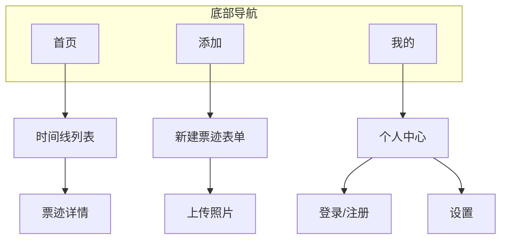
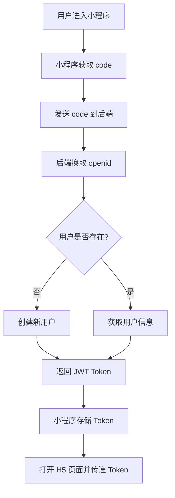
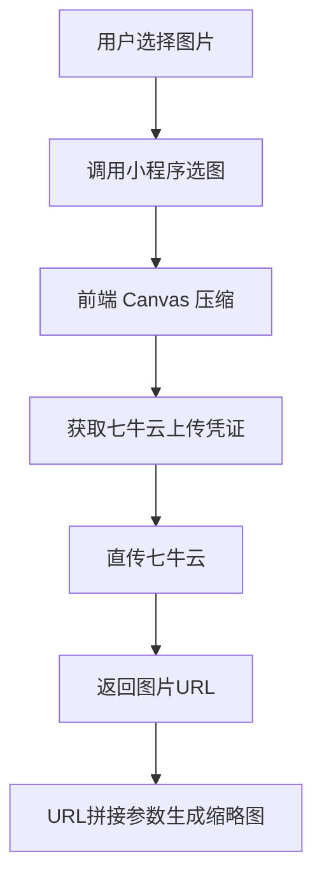
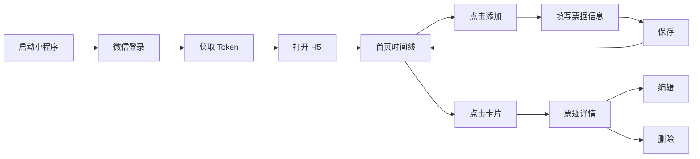

# 票迹 - 产品需求文档 (PRD)

> **实现状态**: ✅ MVP 阶段已完成
> 
> **架构变更说明**: 实际开发采用「小程序壳 + Vue 3 H5 + Go 后端」架构，而非原计划的微信云开发方案。该架构支持热更新、开发效率更高。

## 一、产品概述

### 1.1 产品名称

**票迹**

### 1.2 产品定位

一款帮助用户收藏票据、记录人生轨迹的回忆类微信小程序。

### 1.3 目标用户

- 喜欢记录生活的年轻人
- 经常参加活动、看演出、旅行的用户
- 希望留存美好回忆的用户

### 1.4 核心价值

> 用户打开应用，回忆曾经参加过的活动，看过的演出，去过的地方

---

## 二、功能架构



---

## 三、MVP 核心功能

### 3.1 用户体系 ✅ 已实现

| 功能 | 说明 | 状态 |
|------|------|------|
| 登录方式 | 微信一键登录（主推）/ 可选绑定手机号 | ✅ |
| 登录用户 | 免费额度 **100 张**票据照片 | ✅ |
| 个人主页 | 展示头像、昵称、票据总数、剩余额度 | ✅ |

> **注**: 当前版本暂未实现游客模式，用户需登录后使用。

#### 3.1.1 登录流程（已实现）



#### 3.1.2 手机号绑定规则 ✅ 已实现

- 仅用于换机找回账号（通过手机号关联 openid）
- **一个手机号只能绑定一个账号**
- 不用于登录验证，避免短信成本

### 3.2 票据数据结构 ✅ 已实现

| 字段 | 必填 | 类型 | 说明 |
|------|------|------|------|
| ticketClientId | 是 | String | 客户端生成的 UUID，作为幂等键防重复 |
| name | 是 | String | 票据名称，如"周杰伦演唱会" |
| type | 是 | Enum | 电影票/演出票/展览票/火车票/机票/景区门票/其他 |
| tripNumber | 否 | String | 航班号/车次号（火车票/机票专用）|
| seat | 否 | String | 座位信息（电影票/演出票）|
| hall | 否 | String | 影厅信息（电影票专用）|
| version | 否 | String | 版本信息（IMAX/3D/原版等，电影票专用）|
| showtime | 否 | String | 场次时间（电影票专用）|
| tags | 否 | Array\<String\> | 用户自定义标签，如["周杰伦", "2024巡演"] |
| price | 否 | Number | 票价（元），可不填 |
| photo | 否 | String | 照片URL，限1张 |
| thumbnail | 自动 | String | 缩略图URL（七牛云参数生成） |
| date | 否 | Date | 活动时间 |
| sortTime | 自动 | Date | 排序时间 = date ?? createTime |
| location | 否 | Object | 地点信息（见下方说明） |
| note | 否 | String | 心情/感想 |
| privacy | 否 | Enum | 隐私级别：public（默认）/ private / masked |
| isDeleted | 自动 | Boolean | 软删除标记，默认 false |
| deletedAt | 自动 | Date | 删除时间，30天后可永久删除 |
| createdAt | 自动 | Date | 创建时间 |
| updatedAt | 自动 | Date | 更新时间 |

**地点字段结构（已实现）：**

```typescript
// 地点数据结构
interface Location {
  type: 'single' | 'route';  // single: 单一地点, route: 路线
  // 单一地点
  city?: string;
  address?: string;
  coordinate?: Coordinate;   // 经纬度坐标
  // 路线（火车票/机票）
  departure?: { 
    city: string; 
    station?: string;
    code?: string;           // 机场三字码/车站代码
    time?: string;           // 出发时间 HH:mm
    coordinate?: Coordinate;
  };
  arrival?: { 
    city: string; 
    station?: string;
    code?: string;           // 机场三字码/车站代码
    time?: string;           // 到达时间 HH:mm
    coordinate?: Coordinate;
  };
}

interface Coordinate {
  latitude: number;
  longitude: number;
}
```

**标签系统（已实现）：**

- 10 个全局预设标签（约会、亲子、出差、旅行等）
- 用户可创建自定义标签
- 每张票据最多 5 个标签
- 按使用频率排序推荐

**隐私字段说明（已实现）：**

| 级别 | 值 | 说明 |
|------|-----|------|
| 公开 | public | 默认状态，正常显示所有信息 |
| 私密 | private | 仅自己可见，列表中显示🔒图标 |
| 脱敏 | masked | 展示时脱敏，列表中显示👁图标 |

### 3.3 页面设计 ✅ 已实现

#### 首页（时间线）✅

- 直接展示时间线列表
- **排序规则**：按 `sortTime` 倒序
- **分类筛选**：全部/电影/演出/展览/火车/机票/景区/其他
- 卡片内容：照片缩略图 + 名称 + 类型图标 + 时间 + 地点
- 点击卡片进入详情页
- **分页策略**：游标分页，每页 20 条

#### 添加页 ✅

- 表单页面，按字段录入
- 类型选择后，地点输入框自动切换（单一地点 / 出发-到达）
- **电影票增强**：支持填写影厅、座位、版本、场次
- **交通票增强**：支持填写车次/航班号、出发到达时间
- 地点选择：调用小程序 `wx.chooseLocation` 选择位置
- 图片上传：调用小程序选图 → 前端压缩 → 直传七牛云
- 标签输入：支持从全局/自定义标签中选择或新建

#### 详情页 ✅

- 根据票据类型展示不同布局
- **电影票**：影厅、座位、版本、场次时间
- **火车票**：车次、出发站→到达站、时间
- **机票**：航班号、出发机场→到达机场、时间
- **景区票**：地点、价格
- 支持编辑和删除操作

#### 我的页 ✅

- 头像、昵称
- 票据总数统计
- **容量显示**（已用/总额度，如 88/100）
- 标签管理入口
- 回收站入口
- 关于我们入口

#### 标签管理页 ✅

- 展示全局标签（不可删除）
- 展示用户自定义标签
- 支持创建新标签
- 支持编辑标签名称、颜色
- 支持删除自定义标签

#### 回收站页 ✅

- 展示已删除的票据
- 支持恢复操作
- 支持永久删除操作
- 显示删除时间

#### 关于我们页 ✅

- 隐私政策
- 用户协议

### 3.4 交互规范 ✅ 已实现

#### 3.4.1 状态处理

| 场景 | 处理方式 |
|------|----------|
| 空状态 | 显示插画 + 引导文案 |
| 加载中 | 骨架屏/loading 态 |
| 下拉刷新 | 支持下拉刷新列表 |
| 上拉加载 | 分页加载，每页 20 条 |

#### 3.4.2 操作反馈

| 操作 | 反馈方式 |
|------|----------|
| 保存成功 | Toast 提示"保存成功"，自动返回列表 |
| 删除确认 | 弹窗二次确认 |
| 删除成功 | Toast 提示"已移入回收站" |

### 3.5 视觉规范

#### 3.5.1 设计风格

**极简纯净**：白底 + 线条感，使用 Vant 4 组件库

#### 3.5.2 色彩规范

| 元素 | 色值 | 用途 |
|------|------|------|
| 主色 | #333333 | 标题、重要文字 |
| 辅助色 | #999999 | 次要文字、说明 |
| 强调色 | #07C160 | 按钮、链接（微信绿） |
| 背景色 | #FFFFFF | 页面背景 |
| 卡片背景 | #F7F7F7 | 卡片、分割区域 |

#### 3.5.3 票据类型图标

| 类型 | type值 | 配色 |
|------|--------|------|
| 电影票 | movie | #FF6B6B |
| 演出票 | show | #9B59B6 |
| 展览票 | exhibition | #3498DB |
| 火车票 | train | #1ABC9C |
| 机票 | flight | #2ECC71 |
| 景区门票 | scenic | #F39C12 |
| 其他 | other | #95A5A6 |

---

## 四、技术方案（实际采用）

### 4.1 技术选型

| 层级 | 技术选型 |
|------|---------|
| 小程序壳 | 原生微信小程序 + TypeScript |
| H5 前端 | Vue 3 + Vant 4 + Pinia + TypeScript |
| 后端服务 | Go 1.21 + Gin + GORM |
| 数据库 | MySQL 8.0 |
| 文件存储 | 七牛云 |
| 认证方式 | JWT |

> **架构变更说明**：
> - 原 PRD 计划使用微信云开发
> - 实际采用独立后端方案，优势：
>   1. H5 可热更新，无需小程序审核
>   2. Vue 生态成熟，开发效率高
>   3. Go 后端性能优异，部署灵活
>   4. 代码可复用至公众号、APP

### 4.2 图片处理流程（已实现）



**缩略图生成**：利用七牛云图片处理参数
```
原图URL?imageView2/1/w/300/h/300/q/80
```

### 4.3 数据库设计（已实现）

#### users 表

```sql
CREATE TABLE users (
  id BIGINT PRIMARY KEY AUTO_INCREMENT,
  openid VARCHAR(64) UNIQUE NOT NULL,
  nick_name VARCHAR(64),
  avatar_url VARCHAR(512),
  phone VARCHAR(20) UNIQUE,
  ticket_count INT DEFAULT 0,
  photo_count INT DEFAULT 0,
  photo_quota INT DEFAULT 100,
  created_at DATETIME,
  updated_at DATETIME
);
```

#### tickets 表

```sql
CREATE TABLE tickets (
  id BIGINT PRIMARY KEY AUTO_INCREMENT,
  ticket_client_id VARCHAR(64) UNIQUE NOT NULL,
  user_id BIGINT NOT NULL,
  name VARCHAR(128) NOT NULL,
  type VARCHAR(20) NOT NULL,
  trip_number VARCHAR(32),
  seat VARCHAR(64),
  hall VARCHAR(64),
  version VARCHAR(32),
  showtime VARCHAR(32),
  tags JSON,
  price DECIMAL(10,2),
  photo VARCHAR(512),
  thumbnail VARCHAR(512),
  date DATETIME,
  sort_time DATETIME,
  location JSON,
  note TEXT,
  privacy VARCHAR(10) DEFAULT 'public',
  is_deleted BOOLEAN DEFAULT FALSE,
  deleted_at DATETIME,
  created_at DATETIME,
  updated_at DATETIME,
  INDEX idx_user_deleted_sort (user_id, is_deleted, sort_time DESC)
);
```

#### tags 表

```sql
CREATE TABLE tags (
  id BIGINT PRIMARY KEY AUTO_INCREMENT,
  name VARCHAR(32) NOT NULL,
  type VARCHAR(10) DEFAULT 'custom',
  user_id BIGINT,
  color VARCHAR(16) DEFAULT '#07c160',
  icon VARCHAR(32),
  sort INT DEFAULT 0,
  usage_count INT DEFAULT 0,
  is_active BOOLEAN DEFAULT TRUE,
  created_at DATETIME,
  updated_at DATETIME,
  INDEX idx_user_usage (user_id, usage_count DESC)
);
```

### 4.4 API 接口（已实现）

#### 认证接口

| 方法 | 路径 | 说明 |
|------|------|------|
| POST | /api/auth/login | 微信登录 |
| GET | /api/auth/verify | 验证 token |
| POST | /api/auth/bind-phone | 绑定手机号 |

#### 用户接口

| 方法 | 路径 | 说明 |
|------|------|------|
| GET | /api/user/profile | 获取用户信息 |
| PUT | /api/user/profile | 更新用户信息 |

#### 票据接口

| 方法 | 路径 | 说明 |
|------|------|------|
| GET | /api/tickets | 获取票据列表 |
| POST | /api/tickets | 创建票据 |
| GET | /api/tickets/:id | 获取票据详情 |
| PUT | /api/tickets/:id | 更新票据 |
| DELETE | /api/tickets/:id | 删除票据（软删除） |
| POST | /api/tickets/:id/restore | 恢复票据 |
| DELETE | /api/tickets/:id/permanent | 永久删除票据 |

#### 标签接口

| 方法 | 路径 | 说明 |
|------|------|------|
| GET | /api/tags | 获取所有标签 |
| GET | /api/tags/global | 获取全局标签 |
| GET | /api/tags/custom | 获取自定义标签 |
| POST | /api/tags | 创建标签 |
| PUT | /api/tags/:id | 更新标签 |
| DELETE | /api/tags/:id | 删除标签 |

#### 上传接口

| 方法 | 路径 | 说明 |
|------|------|------|
| POST | /api/upload/token | 获取七牛云上传凭证 |

---

## 五、页面流程



---

## 六、版本规划

### MVP (V1.0) - 最小可用版本 ✅ 已完成

| 功能 | 状态 |
|------|------|
| 微信一键登录 | ✅ |
| 票据 CRUD | ✅ |
| 照片上传（七牛云直传） | ✅ |
| 地点选择（含经纬度） | ✅ |
| 软删除（回收站） | ✅ |
| 首页时间线列表（游标分页） | ✅ |
| 分类筛选导航 | ✅ |
| 标签系统（全局+自定义） | ✅ |
| 隐私设置 | ✅ |
| 容量管理 | ✅ |
| 标签管理页 | ✅ |
| 回收站页 | ✅ |
| 关于我们页 | ✅ |

### V1.1.x - 账号体系增强

| 版本 | 功能 | 说明 |
|------|------|------|
| V1.1.1 | 手机号绑定 | ✅ 已实现 |
| V1.1.2 | 邮箱绑定 | 待开发 |
| V1.1.3 | 账号注销 | 待开发 |

### V1.2.x - 数据管理增强

| 版本 | 功能 | 说明 |
|------|------|------|
| V1.2.1 | 容量进度条 | 待优化（引导清理） |
| V1.2.2 | 批量隐私设置 | 待开发 |
| V1.2.3 | 数据导出 | 待开发 |

### V1.3.x - 搜索筛选

| 版本 | 功能 | 说明 |
|------|------|------|
| V1.3.1 | 关键字搜索 | 待开发 |
| V1.3.2 | 时间范围筛选 | 待开发 |
| V1.3.3 | 城市/标签筛选 | 待开发 |

### V2.0 - OCR & 会员

| 功能 | 说明 |
|------|------|
| OCR识别 | 拍照自动识别票据信息 |
| 会员模块 | 充值后上传无限 |

### V2.1 - 可视化

| 功能 | 说明 |
|------|------|
| 地图模式 | 标记去过的地方 |
| 日历视图 | 按日历形式查看票迹 |

### V2.2 - 数据统计

| 功能 | 说明 |
|------|------|
| 年度报告 | 去过多少地方、看过多少演出等 |

### V3.0 - 社交 & 生态

| 功能 | 说明 |
|------|------|
| 社交分享 | 生成精美图片分享朋友圈 |
| 第三方导入 | 淘票票、12306、猫眼等 |

---

## 七、项目文件结构（实际）

```
planB/
├── README.md                 # 项目说明
├── miniprogram/              # 微信小程序壳
│   ├── app.ts               # 小程序入口
│   ├── app.json             # 全局配置
│   ├── pages/
│   │   ├── index/           # 启动页（登录）
│   │   ├── webview/         # H5 容器
│   │   └── native/          # 原生能力页面
│   │       ├── choose-image/
│   │       ├── choose-location/
│   │       └── bind-phone/
│   └── utils/
│       ├── auth.ts          # 登录逻辑
│       └── bridge.ts        # H5 通信
│
├── h5/                       # Vue 3 H5 应用
│   ├── src/
│   │   ├── views/           # 页面
│   │   ├── components/      # 组件
│   │   ├── stores/          # Pinia 状态
│   │   ├── api/             # API 接口
│   │   ├── types/           # TypeScript 类型
│   │   └── utils/           # 工具函数
│   └── package.json
│
└── server/                   # Go 后端服务
    ├── cmd/server/          # 入口
    ├── config/              # 配置
    └── internal/
        ├── handler/         # 请求处理
        ├── model/           # 数据模型
        ├── middleware/      # 中间件
        └── router/          # 路由
```

---

## 八、确认清单

- [x] 产品定位和目标用户
- [x] 票据字段设计（含类型专属字段）
- [x] 页面结构设计
- [x] 技术方案（小程序壳+H5+Go后端）
- [x] API 接口设计
- [x] 数据库设计
- [ ] 后期规划优先级待确认

**MVP 已开发完成，可进入测试和部署阶段！** 🎉
